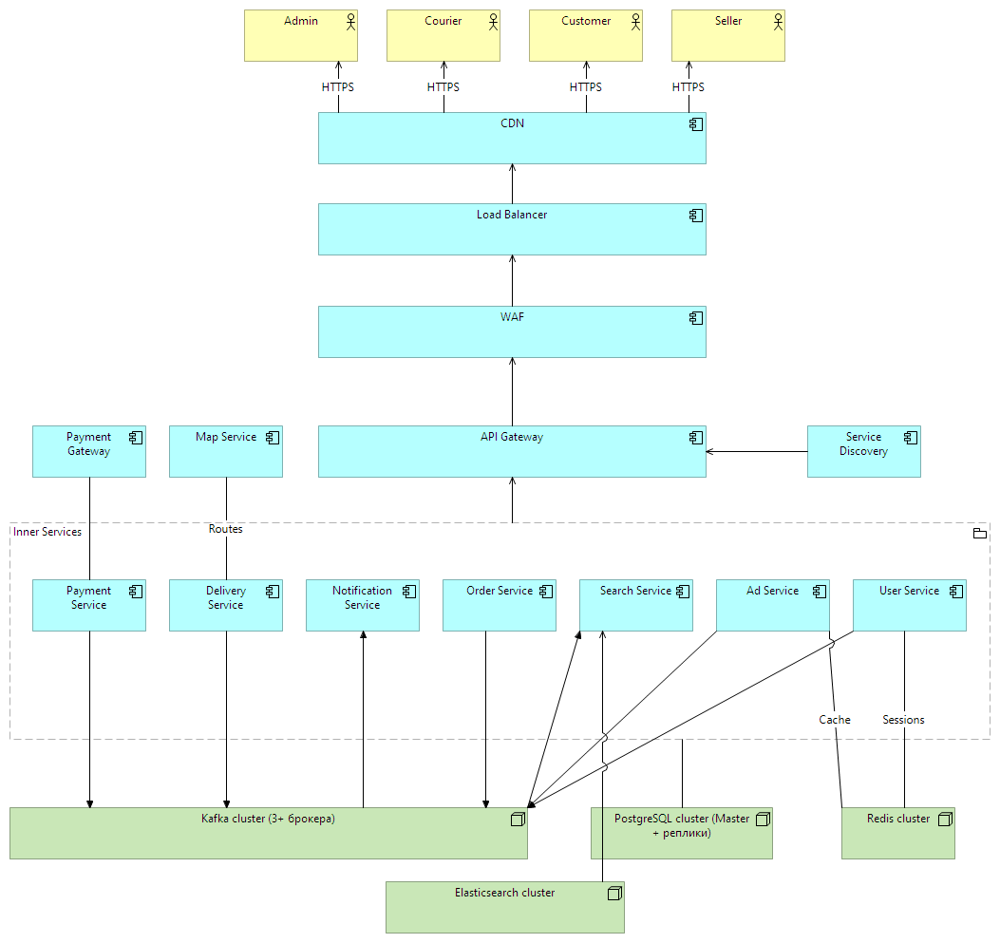
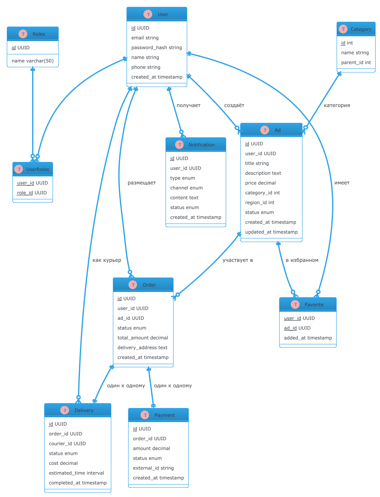
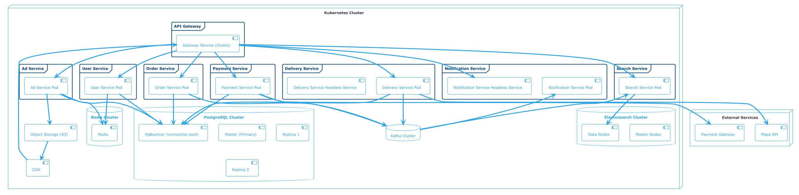
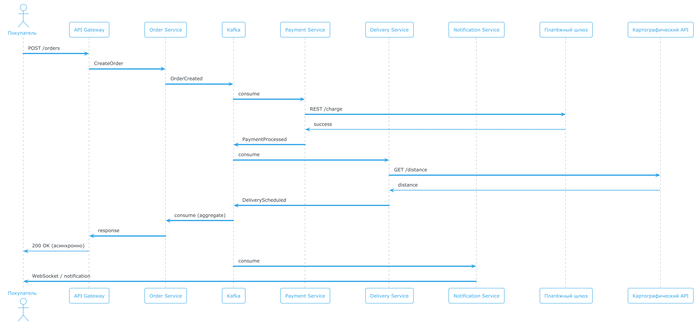
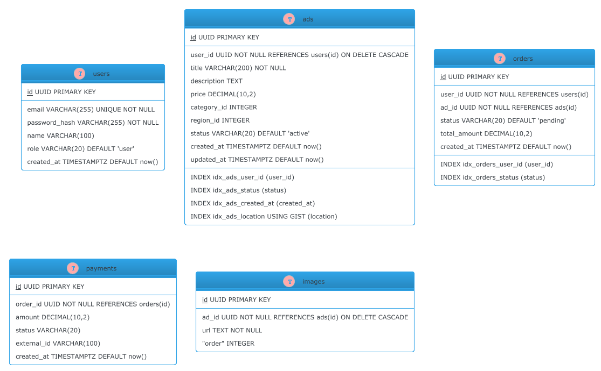

# Проектирование требований и высокоуровневой архитектуры сервиса объявлений с доставкой и проведением оплаты

## Предметная область и ключевые сервисы

| Микросервис           | 	Основные функции                                                                                |
|-----------------------|--------------------------------------------------------------------------------------------------|
| User Service          | 	Регистрация, аутентификация, профили пользователей (роли: покупатель, продавец, курьер, админ). |
| Ad Service            | 	CRUD объявлений, поиск, фильтрация, модерация.                                                  |
| Order Service	        | Создание заказа, управление статусами, связь с доставкой и оплатой.                              |
| Delivery Service	     | Расчёт стоимости доставки, отслеживание курьеров, обновление статуса доставки.                   |
| Payment Service	      | Интеграция с платёжными шлюзами, обработка транзакций, возвраты.                                 |
| Notification Service	 | Отправка уведомлений (email, push) по событиям.                                             |
| API Gateway           | 	Единая точка входа для клиентов, маршрутизация, аутентификация, rate limiting.                  |
| Message Broker        | 	Асинхронное взаимодействие (Kafka) – события домена, задачи.                                    |

Клиентские приложения:

- Web-приложение (Angular)
- Мобильные приложения (в перспективе)

## 1. Требования

### 1.1. Функциональные требования

#### MVP

- Регистрация, аутентификация и управление профилем пользователя (роли: покупатель, продавец, курьер, администратор).
- CRUD‑операции с объявлениями.
- Поиск и фильтрация объявлений по категориям, цене, местоположению.
- Просмотр детальной информации об объявлении (фото, описание, цена, контактные данные продавца).
- Добавление объявления в избранное.
- Оформление заказа на товар/услугу из объявления.
- Выбор способа доставки (курьер, самовывоз) и расчёт стоимости доставки (интеграция с картографическим сервисом).
- Выбор способа оплаты (банковская карта, электронный кошелёк) и проведение платежа через внешний платёжный шлюз.
- Отслеживание статуса заказа (оплачен, передан в доставку, доставлен).
- Отправка уведомлений пользователям об изменении статуса заказа (email, push).
- Личный кабинет покупателя: история заказов, список избранного.
- Личный кабинет продавца: список его объявлений, заказы на его товары.
- Личный кабинет курьера: доступные заказы, отметка о доставке.
- Административная панель: модерация объявлений, управление пользователями, просмотр логов.
- Полнотекстовый и геопоиск по объявлениям.
- Хранение и извлечение пользовательских профилей, объявлений, заказов, платежей.
- Хранение изображений и медиафайлов объявлений.

#### Backlog

- Система отзывов и рейтингов для продавцов и покупателей.
- Чат между продавцом и покупателем.
- Рекомендательная система объявлений на основе поведения пользователя.
- Платные услуги продвижения объявлений.
- Оплата частями или рассрочка.
- Интеграция с внешними службами доставки (СДЭК, Почта России).
- Мобильное приложение (iOS/Android).
- Мультиязычность и поддержка нескольких валют.

### 1.2. Нефункциональные требования

#### 1.2.1. MVP

#### Исчислимые требования

| Категория	           | Показатель	                                        | Целевое значение                                   |
|----------------------|----------------------------------------------------|----------------------------------------------------|
| Производительность	  | Средняя нагрузка (RPS)                             | 	5000 запросов/сек                                 |
|                      | Пиковая нагрузка (RPS)                             | 	10000 запросов/сек                                |
|                      | Время ответа API (p95)	                            | ≤ 200 мс                                           |
|                      | Время ответа поиска (p95)                          | 	≤ 300 мс                                          |
|                      | Чтение объявлений (p95)                            | ≤ 100 мс (из кэша), ≤ 200 мс (из БД)               |
|                      | Время записи объявления (p95)                      | ≤ 500 мс                                           |
| Доступность	         | Uptime                                             | 	99,9% (допустимый простой ≈ 8,76 ч/год)           |
|                      | Доступность критических сервисов (Order, Payment)	 | 99,99%                                             |
|                      | DB Uptime	                                         | 99,99%                                             |
|                      | CDN Uptime	                                        | 99,99%                                             |
|                      | Cache Uptime	                                      | 99,9%                                              |
| Масштабируемость	    | Горизонтальное масштабирование	                    | Автоматическое добавление экземпляров при нагрузке |
| Согласованность	     | Заказы, платежи                                    | 	Строгая (ACID)                                    |
|                      | Поиск, объявления                                  | 	Итоговая (задержка ≤ 5 сек)                       |
| Надёжность доставки	 | Доставка сообщений Kafka	                          | acks=all, репликация 3                             |
|                      | Retry политика                                     | 	3 попытки с exponential backoff                   |
| Сетевые протоколы	   | Внешний API	                                       | REST (HTTP/2)                                      |
|                      | Внутренний синхронный обмен	gRPC                   | (HTTP/2)                                           |
|                      | Уведомления в реальном времени                     | 	WebSockets                                        |
|                      | Асинхронные события	                               | Kafka (сжатие, idempotency)                        |
| Безопасность	        | Аутентификация	                                    | JWT на API Gateway                                 |
|                      | Шифрование	                                        | TLS 1.3, mTLS между сервисами                      |
|                      | WAF	                                               | Защита от OWASP Top 10                             |

#### Неисчислимые требования

- _Безопасность_:
    - Шифрование данных при передаче;
    - Хеширование паролей (bcrypt);
    - Защита от XSS, CSRF;
    - Аутентификация и авторизация с JWT.
- Аудит: логгирование всех критических операций (вход в систему, изменение заказа, платежи).

#### 1.2.2. Backlog

- Автоматическое масштабирование на основе нагрузки.
- Геораспределённое развёртывание для снижения задержек.
- Поддержка нескольких языков интерфейса.
- Интеграция с системами мониторинга и алертинга (Prometheus + Grafana)

#### 1.2.3. Метрики

##### SLI:

- Время ответа API (p95)
- Доступность сервиса
- Количество ошибок

##### SLO:

- 99.9% доступности в месяц, 99,99% для Order & Payment
- 95% запросов < 200 мс, < 300 мс для поиска
- Ошибки < 1%

##### SLA:

- Доступность 99.9% с компенсацией при нарушении.

### 1.3. Риски

| Риск                                                               | 	Вероятность | 	Влияние     | 	Меры снижения                                                                                                            |
|--------------------------------------------------------------------|--------------|--------------|---------------------------------------------------------------------------------------------------------------------------|
| Недоступность внешних сервисов                                     | 	Средняя	    | Высокое      | Таймауты, повторные попытки (retry), кэширование результатов (например, геоданных), использование нескольких провайдеров. |
| Потеря данных при сбое БД	                                         | Низкая       | 	Критическое | 	Регулярное резервное копирование, репликация master‑slave, использование кластерных решений.                             |
| Падение производительности при пиковых нагрузках                   | 	Средняя     | 	Высокое     | 	Горизонтальное масштабирование, кэширование (Redis), шардирование БД, автоскейлинг в Kubernetes.                         |
| Нарушение безопасности (утечка данных, несанкционированный доступ) | 	Низкая      | 	Критическое | 	Шифрование чувствительных данных, строгая аутентификация, аудит.                                                         |
| Несогласованность данных в распределённых транзакциях              | 	Средняя     | 	Среднее     | Использование паттерна Saga для обеспечения итоговой согласованности без блокировок.                                      |
| Перегрузка базы данных при пике	                                   | Средняя      | 	Высокое     | 	Шардирование, реплики чтения, кэширование                                                                                |
| Отказ одного из экземпляров сервиса	                               | Низкая       | 	Среднее	    | Балансировка нагрузки, несколько реплик, автоскейлинг                                                                     |
| Сбой в работе Kafka	                                               | Низкая	      | Высокое	     | Кластер из нескольких брокеров, репликация, мониторинг                                                                    |
| Медленный ответ внешнего платёжного шлюза	                         | Средняя      | 	Среднее     | 	Таймауты, асинхронная обработка, кэширование статусов                                                                    |
| Недостаточная пропускная способность сети	                         | Низкая	      | Среднее	     | Использование балансировщиков с DDoS-защитой, CDN                                                                         |
| DDoS-атака на API Gateway                                          | Средняя      | Среднее      | 	WAF, rate limiting (100 req/sec на IP), использование CDN с защитой                                                      |
| Потеря сообщений в Kafka                                           | Низкая       | Высокое      | 	Репликация, idempotent producer, dead letter queue                                                                       |
| Перегрузка gRPC-каналов                                            | Низкая       | Высокое      | 	Connection pooling, ограничение одновременных стримов                                                                    |
| Несовместимость версий API                                         | Низкая       | Высокое      | 	Версионирование (URL или заголовки), CI/CD с проверкой совместимости                                                     |
| Отказ master БД                                                    | 	Низкая	     | Критическое	 | Автоматический failover, реплики                                                                                          |
| Переполнение диска	                                                | Средняя      | 	Высокое	    | Мониторинг, очистка старых данных                                                                                         |
| Потеря данных в кэше	                                              | Высокая      | 	Низкая	     | Восстановление из БД                                                                                                      |
| Несогласованность кэша и БД	                                       | Средняя	     | Средняя	     | Cache-aside                                                                                                               |
| Медленная загрузка изображений	                                    | Средняя      | 	Средняя     | 	CDN, оптимизация размеров, прогрессивная загрузка                                                                        |
| Высокая стоимость хранения в S3                                    | 	Низкая      | 	Средняя	    |  изменение класса хранения |

## 2. Концептуальная архитектура

### 2.1. Выбор архитектурного стиля

Микросервисная архитектура обоснована следующими факторами:

- _Независимость разработки и развёртывания_: каждый сервис (пользователи, объявления, заказы, платежи, доставка) может
  разрабатываться и масштабироваться отдельно.
- _Технологическая гибкость_: возможность использовать разные СУБД.
- _Отказоустойчивость_: сбой одного микросервиса не останавливает всю систему.
- _Масштабируемость_: горизонтальное масштабирование под нагрузкой только тех сервисов, которые этого требуют.

В качестве альтернативы рассматривался монолит, но он не удовлетворяет требованиям масштабируемости и независимости
команд.

#### 2.2 Схема концептуальной архитектуры



Сетевой стек:

- CDN + WAF – кэширует статику, защищает от DDoS, фильтрует вредоносный трафик.
- Load Balancer – распределяет трафик между экземплярами API Gateway, балансировка на основе генетических алгоритмов.
- API Gateway – единая точка входа, реализован на YARP (C#). Выполняет:
    - Маршрутизацию на основе URL.
    - Аутентификацию (JWT).
    - Rate limiting.
- Service Discovery – используется встроенный DNS Kubernetes.

Протоколы:

- REST – для внешних API (Angular → Gateway).
- gRPC – для высоконагруженных внутренних вызовов между микросервисами (можно и не лезть в gRPC, imho, REST справится не
  хуже, но могу ошибаться).
- WebSockets – для отправки уведомлений в реальном времени.
- Kafka – для асинхронной передачи событий.

Компоненты хранения:

- PostgreSQL Cluster – основное хранилище с гарантией ACID для заказов, платежей, пользователей, объявлений. Репликация
  master‑slave, шардирование по region_id.
- Elasticsearch Cluster – поисковый движок, хранит данные объявлений для быстрого поиска. Шардирование по гео‑хешу.
- Redis Cluster – in‑memory кэш для сессий и популярных объявлений. Используется паттерн cache‑aside.
- Object Storage (S3) – хранилище для изображений и медиафайлов.
- CDN – глобальная сеть доставки для статического контента (изображения, CSS, JS).

#### 2.3. Пользователи решения:

- Покупатель – ищет объявления, оформляет заказы, оплачивает, отслеживает доставку.
- Продавец – управляет своими объявлениями, обрабатывает заказы.
- Курьер – принимает заказы на доставку, отмечает их выполнение.
- Администратор – модерирует объявления, управляет пользователями, просматривает логи.

#### 2.4. Внешние интеграции:

- Платёжный шлюз для обработки платежей,REST API.
- Картографический сервис для расчёта расстояний и стоимости доставки,REST API.

### 2.4 Компоненты

- API Gateway – единая точка входа для всех клиентов. Маршрутизирует запросы к соответствующим микросервисам, выполняет
  аутентификацию, rate limiting.
- User Service – отвечает за регистрацию, аутентификацию, управление профилями и ролями. Хранит данные в PostgreSQL.
- Ad Service – управляет объявлениями. Команды (создание, изменение) пишут в PostgreSQL, события публикуются в Kafka для
  индексации в Elasticsearch.
- Search Service – подписывается на события объявлений, обновляет поисковый индекс Elasticsearch. Обрабатывает поисковые
  запросы от клиентов.
- Order Service – обрабатывает оформление заказа. В рамках Saga взаимодействует с Payment и Delivery сервисами через
  Kafka.
- Payment Service – проводит платежи через внешний шлюз, обновляет статус в PostgreSQL, публикует события.
- Delivery Service – рассчитывает стоимость доставки, взаимодействует с картографическим API, отслеживает статус.
- Notification Service – слушает события Kafka и отправляет уведомления (email, push) пользователям.
- Redis – кэш для сессий(?).
- Kafka – обеспечивает асинхронное взаимодействие между сервисами.

## 2.5 Потоки данных и высокоуровневое взаимодействие

Ключевые сценарии с указанием протоколов:

1. Создание объявления

- Клиент отправляет POST через API Gateway.
- Ad Service
    - загружает изображения в S3, получает URL.
    - сохраняет метаданные объявления в PostgreSQL.
    - обновляет кэш в Redis
- После успешной записи публикуется событие AdCreated в Kafka.
- Search Service потребляет событие и индексирует объявление в Elasticsearch.

2. Чтение объявления:

- Клиент запрашивает объявление по {id}.
- API Gateway направляет запрос в Ad Service.
- Ad Service сначала проверяет Redis: если ключ ad:{id} есть – возвращает из кэша.
- Если нет – загружает из PostgreSQL, сохраняет в Redis, возвращает.

3. Поиск объявлений

- Клиент отправляет запрос на Gateway
- Запрос идёт в Search Service.
- SS выполняет запрос к Elasticsearch, возвращает результаты.

4. доставки изображений:

- Клиент получает URL вида https://cdn.app.com/images/{uuid}.jpg.
- CDN пробует вернуть из кэша, нет - запрашивает из S3, кэширует, возвращает клиенту.
- При обновлении изображения Ad Service отправляет запрос на инвалидацию CDN (API) и удаляет старый объект из S3.

5. Оформление заказа

- Пользователь → REST → API Gateway → Order Service.
- Order Service → Kafka (OrderCreated).
- Kafka → Payment Service → REST (платёжный шлюз) → Kafka (PaymentProcessed).
- Kafka → Delivery Service → REST (картографический API) → Kafka (DeliveryScheduled).
- Kafka → Order Service.

6. Уведомления в реальном времени

- Notification Service → WebSockets → клиент.

## 2.6 Применение шаблонов проектирования

### 2.6.1. CQRS

Применяется в `Ad Service` для разделения операций записи (создание/редактирование объявления) и чтения (поиск,
фильтрация).

- Командная часть использует реляционную БД.
- Запросная часть использует Elastic, обеспечивающую быстрый поиск.
- Синхронизация через Kafka: после успешной команды публикуется событие AdChanged, которое потребляет Search Service и
  обновляет индекс.

_Польза: повышение производительности чтения и масштабируемость._

### 2.6.2. Saga

Хореографическая сага, каждый сервис публикует события и реагирует на них.
Применяется для оформления заказа, включающего резервирование товара, списание средств, вызов доставки.

- Order Service создаёт заказ в статусе "pending" и публикует событие OrderCreated.
- Payment Service получает событие, резервирует средства, публикует PaymentReserved (или PaymentFailed).
- Delivery Service резервирует курьера, публикует DeliveryScheduled.
- Order Service слушает оба события и переводит заказ в статус "confirmed" или инициирует компенсационные действия (
  отмена платежа, освобождение курьера) при сбое.
- Компенсации реализуются через обработчики событий отказов.

_Польза: согласованность данных._

### 2.6.3 Event Sourcing
В системе не используется Event Sourcing, так как это увеличило бы сложность и не требуется для предметной области. Для заказов можно применить Event Sourcing для Order Service, записывая все события, однако, полагаю это излишним.

### 2.6.4  CDN
Используем для изображений и статических ресурсов (CSS, JS).
### 2.6.5  CDC (Change Data Capture)
Применяем Debezium, это снижает нагрузку на приложение и гарантирует, что все изменения попадут в Kafka

### 2.7 Модель данных

Основные сущности и их связи:



Требования консистентности

- Заказы, платежи, доставка – строгая согласованность в пределах одного сервиса; между сервисами обеспечивается конечная
  согласованность через Saga.
- Объявления и поиск – конечная согласованность (допустима задержка индексации).
- Избранное – может быть конечная, так как потеря не критична.

Критичные компоненты и потоки

- Критичные компоненты: Order Service, Payment Service, PostgreSQL (для заказов и платежей), Kafka (для событий).
- Критичный поток: оформление заказа – требует согласованности и отказоустойчивости; любой сбой должен обрабатываться
  компенсационными действиями.

### 2.7 Расчёты показателей решения

#### Исходные данные для расчёта:

- Количество активных пользователей в месяц (MAU): 5 млн
- Среднее количество запросов на пользователя в день: 20
- Дневная нагрузка: 5'000'000 * 20 = 100 млн запросов/день
- Пиковая нагрузка (в час пик, 10% от дневной): 10 млн запросов/час ≈ 2800 RPS
- С учётом роста и неравномерности закладываем пик 10000 RPS

#### Распределение по типам запросов:

- Просмотр объявлений: 60%
- Поиск: 20%
- Действия (создание, редактирование, заказ): 15%
- Прочее: 5%

#### Расчёт нагрузки на ключевые компоненты:

| Компонент	            | Доля запросов	 | RPS (пик)	 | Примечание                        |
|-----------------------|----------------|------------|-----------------------------------|
| API Gateway	          | 100%	          | 10000      |
| Ad Service (чтение)	  | 60%	           | 6000	      | Кэширование снизит нагрузку на БД |
| Search Service	       | 20%	           | 2000       | 	Elasticsearch                    |
| Order Service	        | 5%	            | 500        |
| Payment Service	      | 3%             | 	300       |
| User Service          | 	10%           | 	1000      |
| Notification Service	 | –	             | –	         | Асинхронно                        |

Объём хранимых данных (оценка на 1 год):

| Тип данных    | 	Кол-во записей	             | Средний размер	 | Итого     |
|---------------|------------------------------|-----------------|-----------|
| Пользователи	 | 10 млн	1 КБ	                 | 10 ГБ           |
| Объявления	   | 40 млн (4 на пользователя)   | 2 КБ	           | 80 ГБ     |
| Заказы	       | 100 млн (10 на пользователя) | 1 КБ	           | 100 ГБ    |
| Платежи       | 	100 млн                     | 	0,5 КБ         | 	50 ГБ    |
| Изображения   | 	200 млн (5 на объявление)	  | 200 КБ          | 	40 ТБ    |
| Логи (БД)     | 	-                           | 	-              | 	1 ТБ     |
| Итого		       |                              |                 | 	~41,2 ТБ |

Оценка IOPS для PostgreSQL:

- При пиковой нагрузке - 2000RPS.
- Записи (500 RPS) требуют несколько операций → 2500 IOPS.
- Итого ~4500 IOPS. Для надёжности закладываем 7000 IOPS

Пропускная способность сети:

- Входящий трафик от пользователей: 10000 RPS * средний размер ответа (50 КБ) ≈ 500 МБ/с = 4 Гбит/с
- Исходящий трафик (CDN с изображениями): значительно выше, но разгружается через CDN

#### Расчёты показателей решения с учётом бизнес-событий

Оценка количества технических запросов на основе бизнес-событий:

| Событие	             | Кол-во в пик (RPS) | 	Аффект                                                                      | 	Итоговый RPS                                            |
|----------------------|--------------------|------------------------------------------------------------------------------|----------------------------------------------------------|
| Просмотр объявления	 | 6 000	             | 1 (API Gateway → Ad Service)	                                                | Gateway: 6 000     Ad Service: 6 000                     |
| Поиск                | 	2 000	            | 1 (Gateway → Search)	                                                        | Search: 2 000                                            |
| Создание объявления	 | 300                | 	1 (Gateway → Ad) + 1 (Ad → Kafka) + 2 подписчика                            | 	Ad: 300                            Kafka: 300 сообщений |
| Оформление заказа    | 	500               | 	1 (Gateway → Order) + 3 (Order → Kafka) + по 2 подписчика на каждое событие | 	Order: 500 Kafka: 1500 сообщений                        |
| Платеж	              | 500                | 	1 (Payment ← Kafka) + 1 (Payment → Gateway) + 1 (Payment → Kafka)           | 	Payment: 500 вызовов гейта, 500 сообщений               |
| Доставка	            | 500	               | 1 (Delivery ← Kafka) + 1 (Delivery → карты) + 1 (Delivery → Kafka)	          | Delivery: 500 вызовов карт, 500 сообщений                |

Итоговая нагрузка:

- API Gateway: ~9000 RPS.
- Kafka: ~2 500 сообщений/сек (с учётом множественных публикаций).
- Внешние интеграции: платёжный шлюз – 500 RPS, картографический API – 500 RPS.

### Рост данных
Прогноз на 3 года:

|Показатель| 	Год 1	   |Год 2	|Год 3|
|---|-----------|---|---|
|Пользователи	| 10 млн	   |25 млн|	50 млн|
|Объявления	| 40 млн	   |100 млн	|200 млн|
|Заказы| 	100 млн	 |300 млн	|700 млн|
|Изображения | 	40 ТБ    |	100 ТБ|	200 ТБ|

### Горячие / холодные данные
|Тип данных	| Горячие                             |	Холодные|
|---|-------------------------------------|---|
|Объявления| 	 до 30 дней	                       |старше 90 дней|
|Заказы	| последние 90 дней                   |	старше 1 года|
|Изображения| 	связанные с активными объявлениями |	удалённые объявления|

Политика управления:
Заказы старше 1 года выгружаются в S3 (Parquet) и удаляются из PostgreSQL.
Неактивные объявления через 3 месяца перемещаются на медленный диск.

### Статичные / модифицируемые данные
|Данные	|Статичность|	Частота изменений|
|---|-----------|---|
|Пользователи |	низкая|	редкие обновления профиля|
|Объявления	|средняя|	создание, редкие обновления|
|Заказы|	высокая|	частые изменения статуса|
|Платежи|	высокая	|однократная запись|
|Изображения|	статичны	| только удаление|

### Нагрузка на чтение / обновление (RPS)
|Компонент|	Чтение (RPS)	|Запись (RPS)|
|---|-----------|---|
|PostgreSQL (master)	|2000	|500	|
|PostgreSQL (replica)	|6000	|–|
|Elasticsearch	|2000	|100	|
|Redis	10000	|2000	|
|S3 	|2000	|500	|
|CDN|	10000	|–|

### 2.8. Схема архитектуры решения



### 2.9 Observability

#### 2.9.1 Метрики

| Категория	        | Метрика	                                   | Порог алерта                                 |
|-------------------|--------------------------------------------|----------------------------------------------|
| Infrastructure    | 	CPU, Memory, Disk, Network                | CPU > 80%, Memory > 85%                      |
| Kubernetes	       | Pod status, restarts                       | CrashLoopBackOff, Pending > 5 мин            |
| API Gateway	      | RPS, latency (p95), error rate             | Latency > 200 мс, error rate > 1%            |
| Микросервисы	     | RPS, latency, error rate                   | Latency > 300 мс, error rate > 1%            |
| Базы данных	      | Connections, slow queries, replication lag | Lag > 10 сек, connections > 80% , disk > 80% |
| Redis	            | Hit ratio, memory usage                    | Hit ratio < 0.8, memory > 80%                |
| Elasticsearch	    | Cluster health, shard status               | Yellow/red status                            |
| Бизнес-метрики	   | Количество заказов, платежей               | 	Резкое падение/рост показателей             |
| Kafka	            | Consumer lag                               | Lag > 1000 сообщений                         |
|                   | Количество сообщений в секунду             | Резкое падение/рост > 30% за 10 мин          |
|                   | Размер очереди dead letter                 | 	Любое сообщение в DLQ                       |
| WebSockets        | 	Количество активных соединений            | 	Падение > 20% за 1 мин                      |
| Количество ошибок | Частота ошибок                             | > 1% от попыток соединения                   |
| S3                | 	Error rate                                | > 1%                                         |

#### 2.9.2 Логирование

- Все микросервисы пишут структурированные логи (JSON).
- Loki собирает логи с метками.

#### 2.9.3 Трассировка

- В каждом сервисе внедрён OpenTelemetry SDK.
- Сэмплирование: 10% для высоконагруженных, 100% для ошибок (tail-based).

#### 2.9.4 Алертинг

- Алерты по критическим метрикам.
- Каналы: Slack, Email.

## 2.10 Реагирование на инциденты

План реагирования на отклонения

| Отклонение                        | 	Действие	                                                                      |
|-----------------------------------|---------------------------------------------------------------------------------|
| Высокая задержка API (>300 мс)	   | Проверить метрики БД, кэша, увеличить реплики	                                  |
| Рост ошибок (>1%)	                | Анализ логов, откат последнего деплоя, проверка внешних интеграций	             |
| Падение master БД	                | Автоматический failover (Patroni), проверка целостности	                        |
| Переполнение диска	               | Очистка старых логов, увеличение PVC	                                           |
| Отказ Kafka-брокера	              | Переключение на другие брокеры, проверка репликации	                            |
| Рост consumer lag > 1000	         | Увеличить количество партиций или реплик, проверить производительность сервиса. |
| Большое количество 5xx на Gateway | 	Проверить статус микросервисов, увеличить количество реплик.                   |
| DDoS-атака	                       | Активировать правила WAF(автоматически), включить дополнительный rate limiting. |
| Отказ Kafka-брокера	              | Переключение на другие брокеры (автоматически), проверка репликации.            |
| Miss cache ratio Redis > 20%	     | Увеличить память, пересмотреть TTL                                              |
| Превышение квот S3	               | Пересмотреть политику хранения                                                  |
| Miss cache ratio CDN	             | Проверить настройки кэширования, увеличить TTL                                  |

#### Disaster Recovery (DR) план

Цель: RTO ≤ 1 час, RPO ≤ 15 минут.

Стратегия:

- Регулярные резервные копии PostgreSQL в S3 каждые 15 минут.
- Полные бэкапы Elasticsearch в S3 ежедневно, с временем жизни 30 дней.

Сценарий полного отказа региона:

- Развернуть инфраструктуру в другом регионе.
- Восстановить БД из последнего бэкапа.
- Восстановить Elasticsearch из бэкапа.
- Запустить приложение из последних образов.
- Переключить DNS на новый балансировщик.

## 2.11 Схема взаимодействия (последовательность для оформления заказа)



## 2.12 Форматы взаимодействия

- REST – для внешних API и части внутренних вызовов.
- gRPC – для нагруженных внутренних вызовов .
- Avro – для событий в Kafka, обеспечивает схему и компактность.
- JSON – для кэша в Redis и ответов API.

Пример спецификации для Ad Service:

```yaml
openapi: 3.0.0
info:
    title: Ad Service API
    version: 1.0.0
paths:
    /ads:
        get:
            summary: Поиск объявлений
            parameters:
                -   name: query
                    in: query
                    schema:
                        type: string
                -   name: page
                    in: query
                    schema:
                        type: integer
            responses:
                '200':
                    description: OK
        post:
            summary: Создать объявление
            requestBody:
                required: true
                content:
                    application/json:
                        schema:
                            $ref: '#/components/schemas/AdCreate'
            responses:
                '201':
                    description: Created
```

Пример схемы событий Kafka

```json
{
    "type": "record",
    "name": "OrderCreated",
    "fields": [
        {
            "name": "order_id",
            "type": "string"
        },
        {
            "name": "user_id",
            "type": "string"
        },
        {
            "name": "ad_id",
            "type": "string"
        },
        {
            "name": "total_amount",
            "type": "double"
        },
        {
            "name": "timestamp",
            "type": "long"
        }
    ]
}
```

## 2.13. Система хранения данных

### 2.13.1. PostgreSQL
- Класс: Реляционная СУБД.
- Выбор: PostgreSQL.
- Масштабирование: шардирование.
- Высокая доступность: Кластер с мастером и двумя синхронными репликами. Patroni для автоматического failover. PgBouncer для пула соединений.
- CAP: CP.
- Ограничения: максимальный размер таблицы.
- Бэкапы: Полные бэкапы каждые 6 часов, WAL архивация каждые 15 минут в S3. Хранение бэкапов 30 дней.

### 2.13.2. Elasticsearch
- Класс: NoSQL, поисковая.
- Выбор: Elasticsearch.
- Масштабирование: Кластер из нескольких узлов.
- Высокая доступность: Реплики шардов.
- CAP: AP.
- Ограничения: Итоговая согласованность, ограниченная поддержка транзакций.
- Бэкапы: ежедневно, время жизни - 30 дней.

### 2.13.3. Redis
- Класс: In-memory store.
- Выбор: Redis .
- Масштабирование: Кластер.
- Высокая доступность: Реплики, автоматическое переключение при отказе мастера.
- CAP: CP.
- Ограничения: Ограниченная память.
- Бэкапы: каждые 6 часов.

### 2.13.4. Object Storage (S3)
- Класс: Объектное хранилище.
- Выбор: AWS S3.
- Масштабирование: Горизонтальное.
- Высокая доступность: Репликация между зонами.
- CAP: AP.
- Ограничения: Итоговая согласованность.
- Бэкапы: копирование между регионами.

### 2.13.5. CDN
- Класс: Глобальная сеть доставки контента.
- Выбор: AWS CloudFront.
- Масштабирование: Автоматическое.
- Высокая доступность: Геораспределённые узлы.
- CAP: AP.
- Ограничения: Итоговая согласованность.
- Бэкапы: Не требуется.

## 2.14. Схемы данных

### 2.14.1. Физическая схема PostgreSQL (фрагмент)



Индексы и партиционирование:

- Таблица orders партиционирована по диапазону created_at.
- Таблица ads шардирована по region_id.

### 2.14.2. Стратегии обеспечения согласованности

| Тип данных     | 	Стратегия                 | 	Описание                                                                                                                                                         |
|----------------|----------------------------|-------------------------------------------------------------------------------------------------------------------------------------------------------------------|
| Объявления     | 	Итоговая согласованность	 | Событие AdChanged из Kafka → Search Service обновляет индекс .                                                                                  |
| Кэш объявлений | Cache‑aside 	              | При чтении: если нет в Redis – загрузить из PostgreSQL и записать. При записи: удалить ключ ad:{id} и опубликовать событие для удаления из кэша во всех репликах. |
| CDN	           | Инвалидация по URL         | 	При обновлении изображения Ad Service вызывает API CDN для инвалидации конкретного URL.                                                                          |
| Сессии         | 	Прямая запись в Redis	    | При входе запись в Redis, при выходе – удаление.                                                                                                                  |

### 2.14.3. Геораспределённость и резервное копирование
- Бэкапы: Хранятся в S3 в двух регионах. Для критических данных (заказы, платежи) используется cross‑region replication.
- Распределённая обработка: Elasticsearch и Redis кластеры распределены по зонам в пределах региона. Kafka также с репликацией между зонами.

